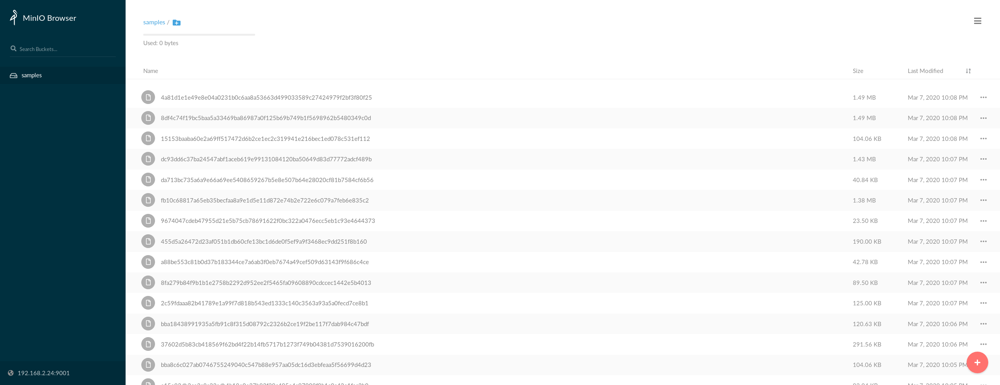
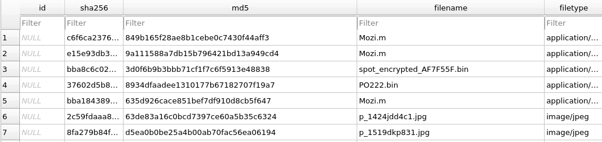
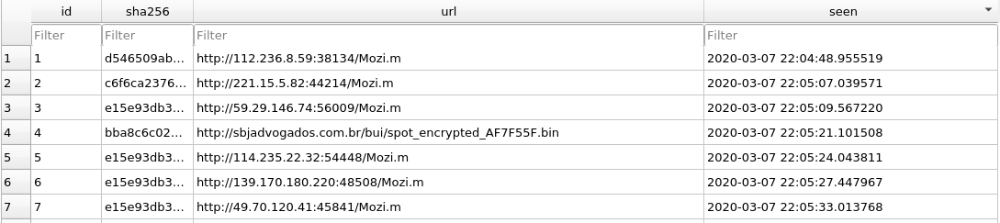

# aquarium 🐟

A self-hosted system for the automatic procurement, creation, and cataloging of your own malware museum or archive.


##### _"Normal people just have aquariums"_

## Use cases / Usefulness:

Besides being an interesting and novel project, running my own instance of aquarium should with time should greatly enrich threat intelligence feeds by contributing thousands of indicators of compromise (IOCs), as well as creating hundreds or thousands of virus signatures for ClamAV's signature database. 

## To-Do:
- [ ] Add a work queue and worker system where URLs are thrown into a work queue and processed
  - **This is especially important so that it is easy for the user to, upon finding a malware dump on the internet, dunk the samples into the aquarium and have it work away at them.**
- [ ] As part a of worker based system, in addition to downloading and archiving samples, workers should:
  - Perform enrichment for the following sources:
    - [ ] Open Threat Exchange (through the extraction of IOCs)
    - [ ] ClamAV signature database by scanning samples and generating signatures for samples which aren't detected.
  - [ ] Perform dynamic and network analysis
    - [ ] Achievable by running a Cuckoo sandbox and utilizing its REST/Python API
- [x] To support a worker system, it is necessary to migrate to a database that better supports concurrent reading/writing.
- [ ] Create a simple REST API to query your malware museum that returns collected metadata about a sample (and optionally the sample itself)

## Demo

This is the end result of downloading samples. The actual files themselves are stored in a MinIO store:


For cataloging purposes, information about the samples are kept in an SQL database under a `samples` table, and a second table, `sources`, stores information about where the sample was found. 

This allows for a few interesting possibilities:
1. Perform a lookup for metadata about a sample, given it's hash
2. Lookup the actual sample file itself given it's hash, name, origin URL, etc
3. Correlation of C&C infrastructure and operations by discovering multiple URLs/domains serving the same hash


**Samples**


**Sources**


## Development

When updating the dependencies for the Dockerfile, run:

```bash
poetry run pip freeze > requirements.txt
```

If you run into a siutation where Docker doesn't seem to be 'stuck' and not running the latest version of the project (whether it be old code, old configs, etc), consider:

```
docker system prune --volumes # Assuming you have no other currently unused volumes
rm -rf data/
docker-compose up --build
```
